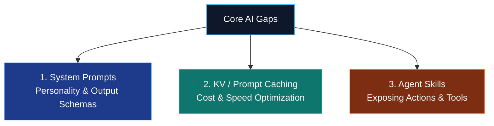

# Core Knowledge Gaps & Study Guide

This document tracks specific, high-priority conceptual gaps you have identified: **System Prompts**, **KV / Prompt Caching**, and **Agent Skills**. 

Use this guide as a quick reference to understand how they work, why they are important, and how to programmatically implement them as you progress through the Labs.

---



---

## 🧠 1. System Prompts (The Personality & Rules Engine)

### What Is It?
In modern LLM chat APIs, the **System Prompt** is a separate, high-level instruction block that is processed before the conversation begins. Think of it as the **firmware** or **compiler constraints** of the model, whereas the user's prompt represents the **runtime variables**.

### Why Is It Critical?
*   **Behavioral Constraints:** Prevents the model from breaking character or discussing unsafe topics.
*   **Output Schemas:** Forces the model to respond in exact, structured formats (like JSON) rather than conversational text.
*   **Role-Play Alignment:** Steers the model to act as a senior auditor, a customer representative, or a compiler, drastically changing the quality of output.

### How to Implement It
In your code, never put system instructions inside the standard `messages` array if the SDK supports a top-level `system` argument.

#### 🐍 Python Example (Anthropic SDK):
```python
import anthropic

client = anthropic.Anthropic()

response = client.messages.create(
    model="claude-3-5-sonnet-20241022",
    max_tokens=1024,
    # System Prompt defined outside the messages array
    system="""You are a strict code review assistant. 
    Analyze the user's input ONLY for SQL injection vulnerabilities.
    Respond exclusively in valid JSON format:
    {
        "vulnerable": true/false,
        "explanation": "string details"
    }""",
    messages=[
        {"role": "user", "content": "SELECT * FROM users WHERE username = '" + user_input + "'"}
    ]
)
print(response.content[0].text)
```

---

## ⚡ 2. KV / Prompt Caching (Cost & Speed Optimization)

### What Is It?
When an LLM processes your prompt, it converts it into key-value (KV) states (called the **KV Cache**) so it doesn't have to recompute those tokens on subsequent steps of the conversation. **Prompt Caching** allows the provider to cache these KV states *across different API calls* for multiple minutes.

### Why Is It Critical?
*   **Massive Cost Savings:** Reduces your input token bill by up to **90%**.
*   **Massive Latency Reduction:** Lowers model response time by up to **80%**.
*   **Enables Huge Contexts:** Makes uploading 100-page PDF manuals, complete codebases, or database schemas feasible and affordable on every single call.

### How to Implement It
To trigger caching, your system prompt or long context block **must be at least 1,024 tokens long** (for Anthropic) and placed at the top of the prompt. You add a `cache_control` tag to the block you want the provider to remember.

#### 🐍 Python Example (Anthropic SDK):
```python
response = client.messages.create(
    model="claude-3-5-sonnet-20241022",
    max_tokens=1024,
    system=[
        {
            "type": "text",
            "text": "You are a helpful analyst."
        },
        {
            "type": "text",
            "text": "Here is the complete company employee manual: " + massive_employee_manual_text,
            "cache_control": {"type": "ephemeral"} # <--- Tells Claude to cache this huge block!
        }
    ],
    messages=[
        {"role": "user", "content": "What is the policy on annual leave?"}
    ]
)
# Note: Subsequent calls querying the same manual will hit the cache, costing 90% less.
```

---

## 🛠️ 3. Agent Skills (Exposing Actions & Tools)

### What Is It?
An **Agent Skill** is a custom programming function (written by you in Python or TypeScript) that you expose to the LLM. You give the function a highly descriptive docstring and input typing, and the LLM decides *when* to execute your code based on the user's goals.

### Why Is It Critical?
*   **Bypasses LLM Limits:** LLMs cannot do math, access the live web, edit local files, or run database queries. Exposing these operations as "skills" bridges this gap.
*   **Standardization:** Modern standards like **MCP (Model Context Protocol)** allow you to write a skill once and expose it to Claude Code, Cursor, or custom Python agents without rewriting code.

### How to Implement It
You write standard functions with clear type hints and docstrings. Modern frameworks use these details to auto-generate JSON schemas that are sent to the LLM.

#### 🐍 Python Example (FastMCP Tools):
```python
from mcp.server.fastmcp import FastMCP
import requests

mcp = FastMCP("My Weather & Calendar Server")

# The LLM reads the function name, docstring, and argument types as its instruction manual!
@mcp.tool()
def get_local_weather(city: str) -> str:
    """
    Fetch the live weather forecast for a specified city.
    
    Args:
        city: The name of the city (e.g., 'Paris', 'New York').
    """
    # Exposing a real web action to the LLM
    response = requests.get(f"https://wttr.in/{city}?format=3")
    return response.text

if __name__ == "__main__":
    mcp.run()
```

---

## 🎯 Gap-to-Lab Mapping Tracker

Use this checklist to ensure you have actively practiced and mastered these three components:

- [ ] **System Prompts Mastered:**
    *   *Practiced In:* **Lab 4** (setting MCP assistant rules) & **Lab 5** (profile extraction JSON schemas).
    *   *Advanced Practice:* **Lab 1** (FastAPI production validation schemas) & **Lab 2** (orchestrating different agent prompts in Langgraph).
- [ ] **KV / Prompt Caching Mastered:**
    *   *Practiced In:* **Lab 5** (caching the resume profile extraction system instructions).
    *   *Advanced Practice:* **Lab 1** (caching large enterprise RAG context buffers).
- [ ] **Agent Skills Mastered:**
    *   *Practiced In:* **Lab 4** (creating local weather & file todo tools using FastMCP).
    *   *Advanced Practice:* **Lab 2** (Langgraph coordinating multi-agent MCP tool calls) & **Lab 6** (CrewAI search tools).
