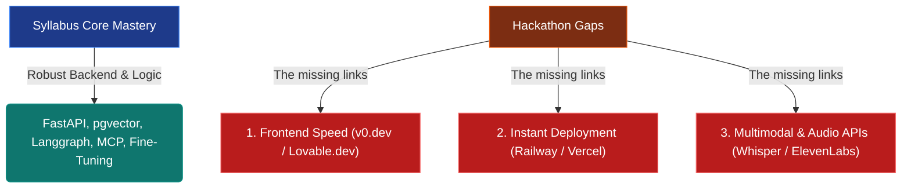

# AI Hackathon Readiness & Action Plan

This document acts as your roadmap to transition from the **Mastery Labs** (which build core AI backend engineering skills) into competing (and winning) as a solo developer in **AI Hackathons**.

In a typical 24-to-48-hour AI hackathon, the key success factors are:
1.  **Speed of Prototyping:** Spinning up a fully functional, beautiful app in hours.
2.  **Visual "Wow" Factor:** Modern, interactive user interfaces with responsive animations.
3.  **Deployment & Access:** An instant public URL that judges can open immediately on their devices.
4.  **Multimodal & Streaming APIs:** Interactive voice, video, or real-time streaming elements.

---

## 🚨 The Hackathon Skill Gaps

While the **6 Mastery Labs** equip you with elite backend, agentic state (Langgraph), and local serving architecture knowledge, hackathons require bridging three specific gaps:

### 1. Frontend Speed & Prototyping (The "Wow" Factor)
*   **The Cheat Code:** Do not write custom CSS or complex React boilerplate from scratch under time constraints.
*   **The Toolkit:**
    *   **v0.dev (by Vercel):** Describe your interface in plain English (e.g., *"A futuristic dark-mode dashboard for an AI recruiter with active charts and glassmorphism styling"*), copy the generated React/Tailwind component, and drop it in.
    *   **Lovable.dev:** An excellent alternative for instant full-stack application mockups.
    *   **Shadcn/ui:** Copy-paste highly polished, pre-designed interactive components (modals, calendars, buttons).

### 2. Instant Zero-Config Deployment
*   **The Cheat Code:** Bypass complex Docker configs, AWS EC2 instances, and security groups in a 24-hour run.
*   **The Toolkit:**
    *   **Vercel:** Instantly host your React/Next.js frontend. Push to GitHub, and Vercel deploys a public URL in 30 seconds.
    *   **Railway.app:** The fastest way to host your FastAPI Python backend + PostgreSQL database. It reads your codebase and spins up the environment with three clicks.
    *   **Supabase:** Exposes an instant PostgreSQL + `pgvector` cloud instance out of the box with zero database administration.

### 3. Multimodal & Streaming APIs
*   **The Cheat Code:** Connect your core agents to real-time voice or image gen to make them feel "alive."
*   **The Toolkit:**
    *   **Voice Assistant:** Whisper API (Speech-to-Text) + GPT-4o/Claude 3.5 + ElevenLabs API (Text-to-Speech).
    *   **Real-time Streaming:** Use FastAPI WebSockets or Server-Sent Events (SSE) to stream text token-by-token.
    *   **Image Generation:** Run rapid calls to DALL-E 3, Midjourney, or Flux API tracks.

---

## 🎯 The Transition: 24-Hour Mock Hackathon Blueprint

Before entering a real public hackathon, execute this **24-Hour Mock Run** on a weekend to test your setup and speed.

### The Objective: Build "Voice-Chef"
An interactive, voice-activated AI recipe planner that creates a custom meal calendar, generates images of the food, and texts/emails you a structured shopping list.

### ⏱️ Hourly Timeline Spec:

| Hours | Phase | Target Deliverables |
| :--- | :--- | :--- |
| **00:00 - 02:00** | **Design & Prompting** | Outline the Pydantic data models for meals. Write the system prompts. |
| **02:00 - 06:00** | **Backend Logic** | Build a FastAPI app. Hook up a basic RAG system containing a mock vector index of recipes. |
| **06:00 - 10:00** | **Frontend Generation** | Use **v0.dev** to generate a beautiful dark-mode React dashboard. Wire it to your FastAPI endpoints. |
| **10:00 - 14:00** | **Multimodal Integration** | Integrate **Whisper** to let the user record their food preferences by voice, and **DALL-E 3** to generate dish images. |
| **14:00 - 18:00** | **Cloud Deployment** | Deploy the frontend to Vercel and the backend to Railway. Verify public endpoints work. |
| **18:00 - 24:00** | **Demo Prep & Testing** | Record a 2-minute Loom video demonstrating the product. Fix any UI rendering bugs. |

---

## 🎓 Hackathon Readiness Checklist
Before entering a real competition, ensure you can tick these boxes:
- [ ] I have a "Frontend Starter Kit" repository ready on GitHub with configured routers and tailwind presets.
- [ ] I can deploy a FastAPI backend to Railway in under 10 minutes.
- [ ] I can generate and style a dashboard using v0.dev and connect it to a real REST API.
- [ ] I have successfully integrated a voice transcription or image generation API.
- [ ] I can record, edit, and export a polished 2-minute product pitch video.
