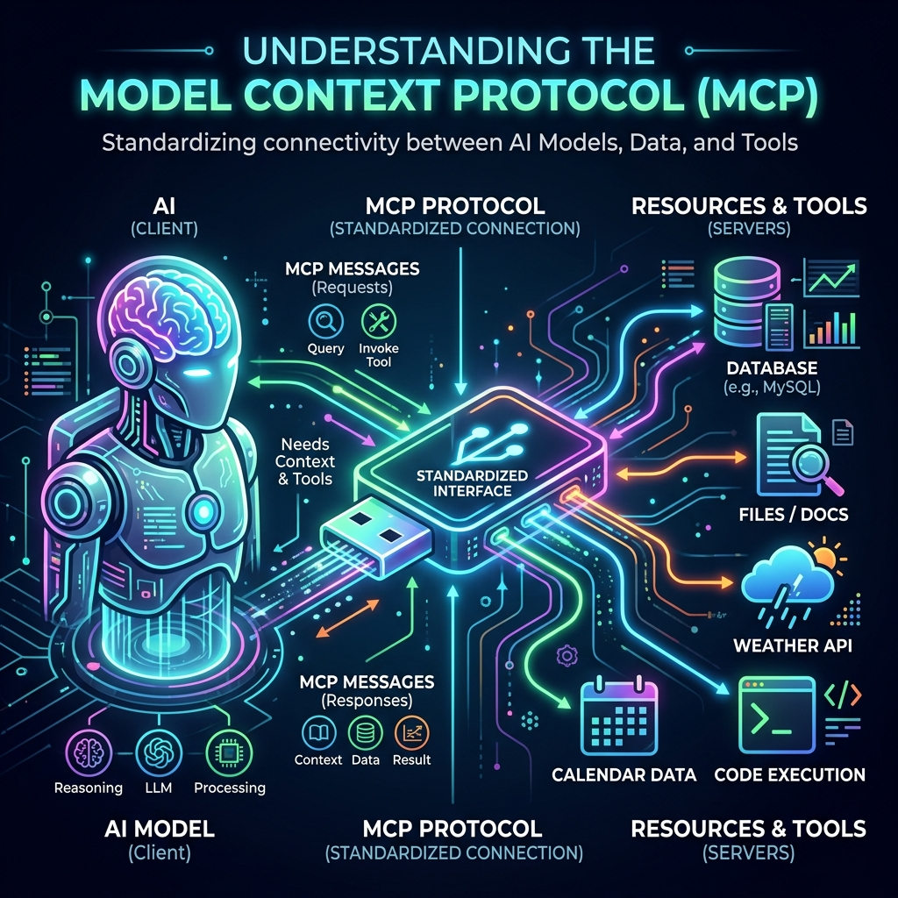

# 🧠 The Ultimate Guide to Tool Calling & MCP (Model Context Protocol)

*A conceptual breakdown designed for easy sharing on LinkedIn, X, and personal study.*

---

## 🧩 Part 1: The Raw Superpower (Tool Calling)

Before we talk about MCP, we have to understand the engine powering it: **Tool Calling** (sometimes called Function Calling). 

### What is it?
About a year ago, LLMs (like GPT-4 and Claude) were trained to do something completely new. Instead of just replying with text, they were trained to output **structured JSON requests** to run code.

> **💡 The Analogy:** 
> Imagine the AI is locked in a room without internet. You ask it: *"What is the weather in Tokyo?"*
> Instead of saying *"I don't know"*, the AI outputs a raw JSON request: 
> `{"name": "get_weather", "arguments": {"location": "Tokyo"}}`
> It is essentially saying: *"I can't answer this, but if you (the computer) run a function called `get_weather` for Tokyo and give me the result, I will summarize it for the user."*

### The Problem (Before MCP)
When an LLM outputs that JSON tool call, **it doesn't actually run the code**. It is just asking *you* to run it. 
Historically, developers had to write messy, custom "glue code" for every single app to:
1. Catch that JSON request.
2. Find the local Python script.
3. Run the script.
4. Translate the output back into a format the LLM understands.

---

## 🔌 Part 2: The Universal Solution (MCP)

**MCP (Model Context Protocol)** is the ultimate, standardized "Glue Code." It is an open-source standard invented by Anthropic (the makers of Claude).

### The USB-C of AI
Before USB-C, every phone had a different charger. Before MCP, every AI app (ChatGPT, Claude, custom agents) had a different way of connecting to local tools. Anthropic invented the MCP "rulebook" to standardize how AI models talk to data.

> **💡 The Analogy:**
> - **Tool Calling** is the AI having the *ability* to dial a phone number and ask to order a pizza.
> - **MCP** is the universal *switchboard* that automatically catches the AI's call, routes it to the correct local pizza shop (your Python script), places the order, and hands the pizza back to the AI.

### The Terminology Breakdown
If you want to sound like a Senior AI Engineer, here is how you use the vocabulary:

1. ❌ **"I am building an MCP."** *(Wrong. MCP is the protocol, like USB-C).*
2. ✅ **"I built an MCP Server."** *(This is the Python/Node application running on your machine that connects to a database or API).*
3. ✅ **"My server exposes two Tools."** *(Tools are the actual functions inside your server, like `read_file` or `fetch_weather`).*
4. ✅ **"Claude Desktop is my MCP Client."** *(The Client is the AI application that looks through the server to see the tools).*

---

## 🚀 Why This Changes Everything

Because MCP is standardized, we only have to build integrations **once**.

Anthropic built the **GitHub MCP Server** to kickstart the ecosystem. Because it uses the MCP standard, *any* AI app (Claude Desktop, Cursor IDE, or your own custom Python agent) can instantly plug into that server and gain the ability to read GitHub PRs, without writing custom integration code for every new AI app.

Build the "USB" device once, and plug it into any AI you want.

---
*Created as part of the AI Mastery Labs project.*
